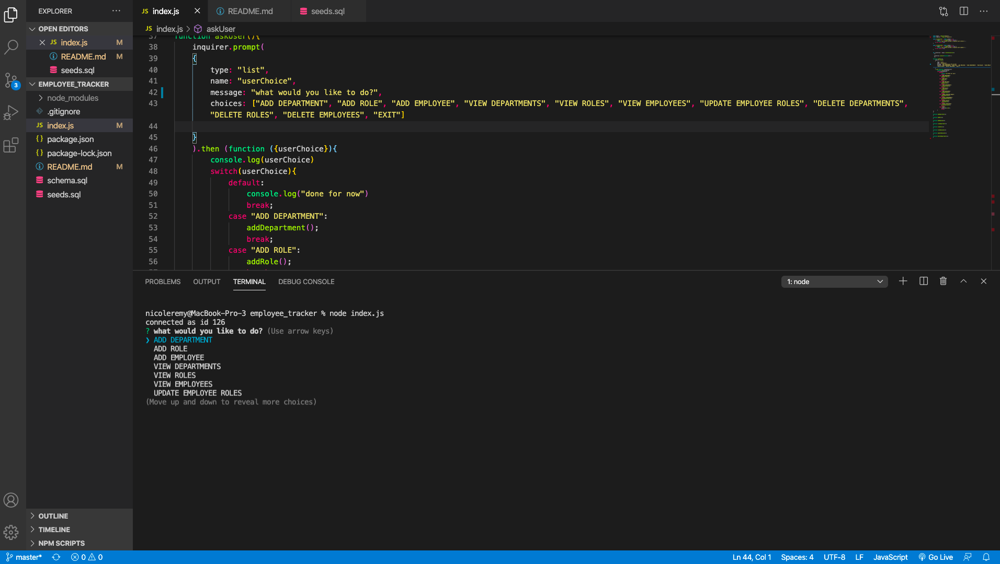
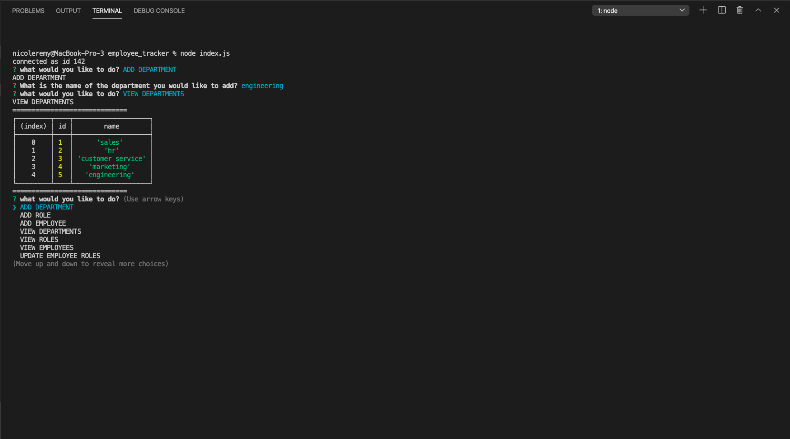
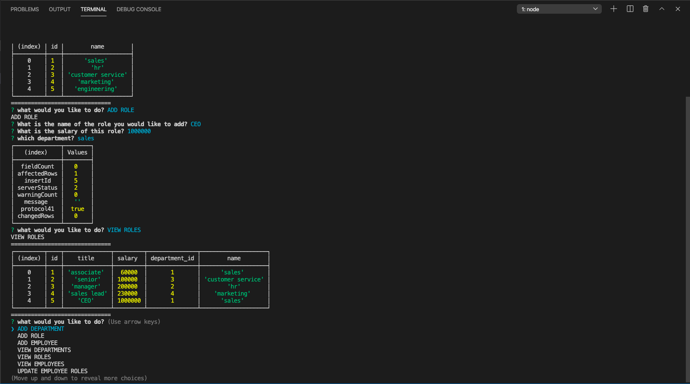
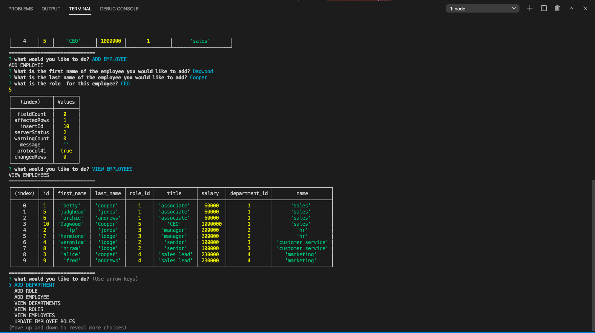
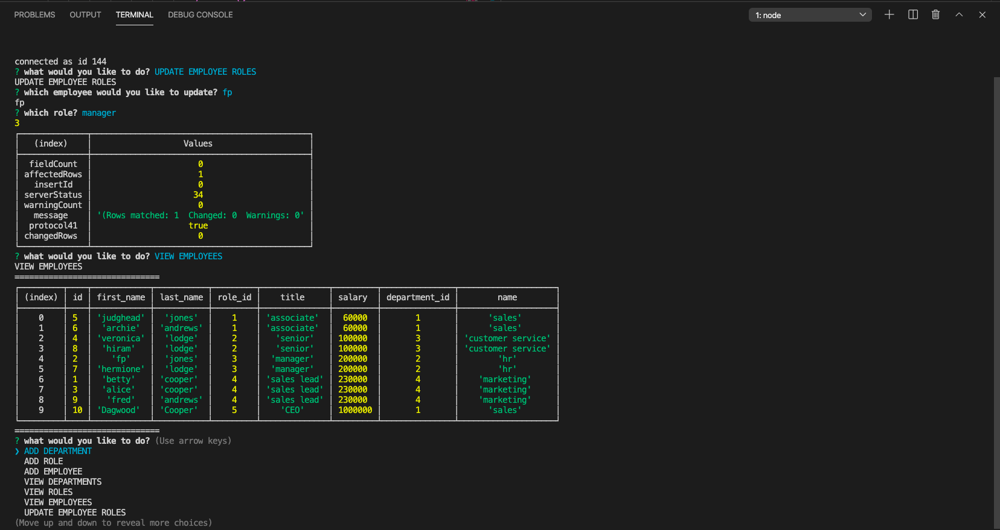

# employee_tracker
employee tracker cli; inquirer and  mysql 

# template_engine_employee_summary
hw 7 template engine employee summary 

### Description
This application manages a company's employees using node and MySQL through a command-line application using the [Inquirer package](https://www.npmjs.com/package/inquirer). The user only has to type node index.js in the terminal to begin the application. After this, the user is prompted to choose from a list of options to either view, add, or update either an employee, role, or department. The application already has a built-in data table and table data for reference found in the schema.sql and seeds.sql file respectively; this should be input into MySQL.  

To handle edge cases, I added a validate property on each inqurier prompt object validating either a number, string, or empty input. There is also a recursive function that continues to ask the user questions until they choose EXIT. Please note, to run on your computer, please update the "password" on line 27 of the index.js file to your MySQL password. 

    
## Table of Contents
1. [Installation](#installation)
2. [Usage](#usage)
3. [License](#license)
4. [Contributing](#contributing)
5. [Tests](#tests)
6. [Questions](#questions)

### Images of Employee Profile Process

### Step 1

### Step 2

### Step 3

### Step 4

### Step 5

### Installation
In terminal, please make sure to npm init -y and npm i inquirer mysql, then require the package in your js file. Also, please update the "password" on line 27 of the index.js file to your MySQL password. 

### Usage
This application can be used to manage a companies employees, roles, and departments. 

### License 

This application is covered under MIT.

### Contributing 
Pull requests are welcome. For major changes, please open an issue first to discuss what you would like to change.

### Tests
Please make sure to update tests as appropriate.

### Questions
1. [Github](https://github.com/nicoleremy95)

### Link to Video of Application
1. [EMPLOYEE TRACKER](https://drive.google.com/file/d/1QwCm1s24y60vBc7kDLJNDbWrIdjgMnMF/view)
    
    